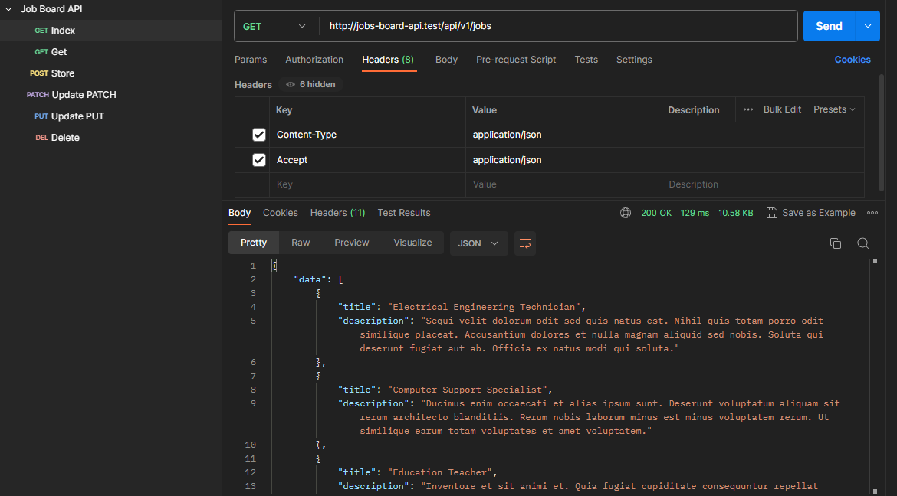
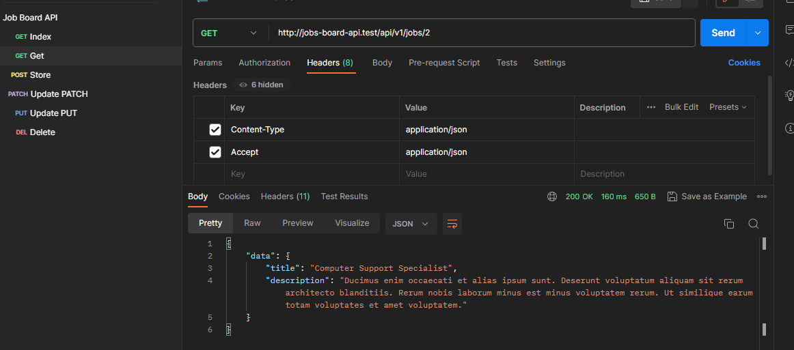
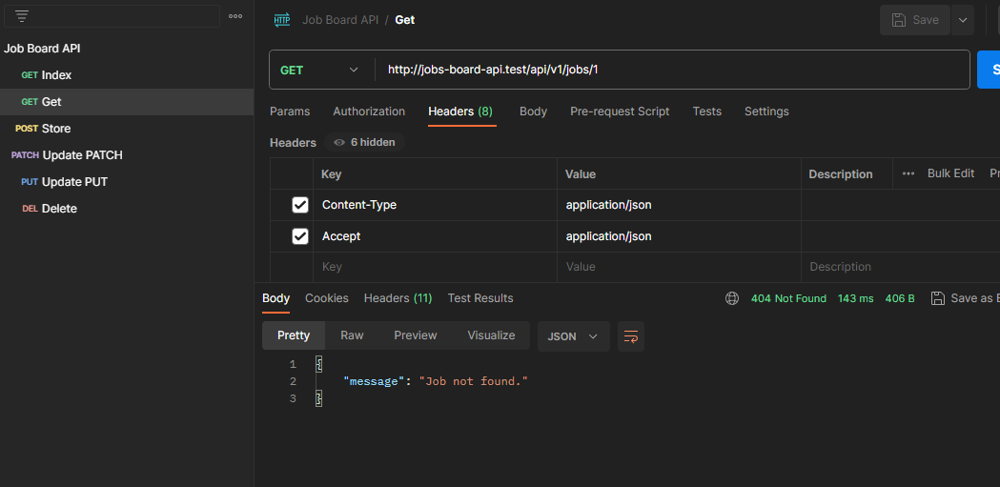
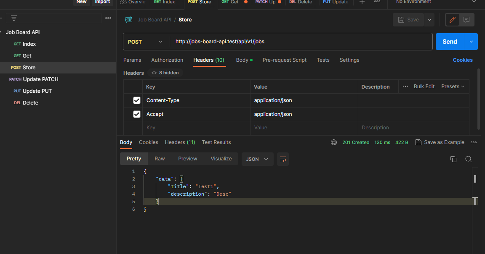
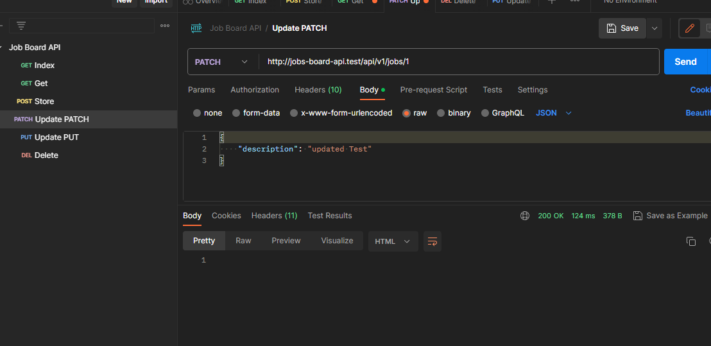
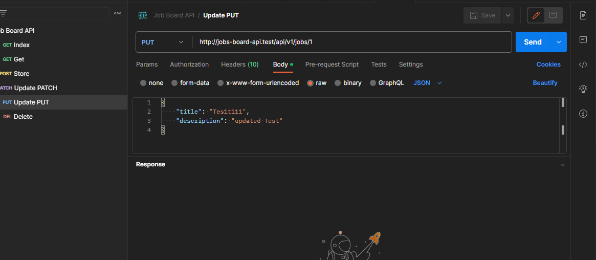
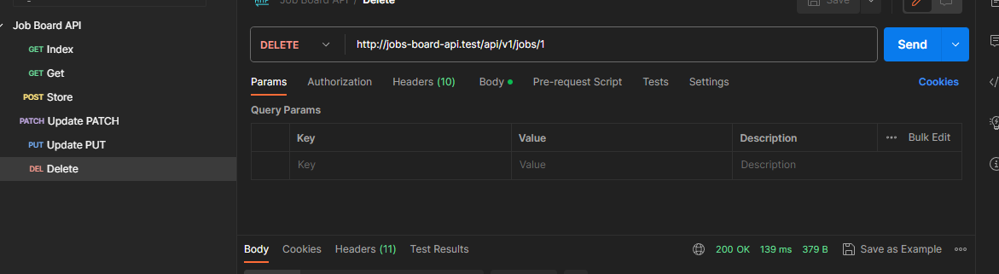

# Job Board API for Skill Assessment

## Development

- Developed using [Laragon](https://laragon.org/)
- PHP Version php-8.1.10-Win32-vs16-x64
- MySQL mysql-8.0.30-winx64

## Postman Collection

- Please click [here](https://api.postman.com/collections/13216823-68140a83-bbd2-44ca-972e-108001e79a49?access_key=PMAT-01H5ME1JA5J0MS4ZBWD927CF8S) to get generated shared postman collection

## Screenshots

| Method          | Screenshot |
|-----------------| --------- |
| Index           ||
| Get (Found)     ||
| Get (Not Found) ||
| Store           ||
| Patch           ||
| Put           ||
| Delete           ||